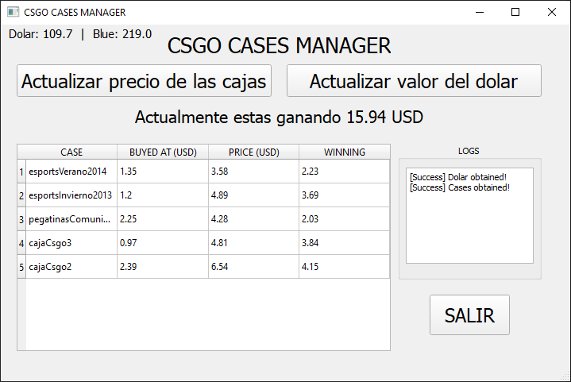

<h1 align="center">CSGO CASES MANAGER</h1>

</img>

## Starting 🚀

### How it works:
CSGO CASES MANAGER shows to you if your cases (or items) you bought are generating earnings or not.
Currency is USD.

### Requirements:
```
TinyDB==3.15
PyQt5
PyQt5.QtCore
PyQt5.QtWidgets
```

### Downloading:
```
git clone https://github.com/matifanger/csgo-cases-manager
cd csgo-cases-manager
pip3 install -r requirements.txt 
```

## Configuring ⚙️
Open (`database/bp.json`) and fill with initial data.
The 0 values should keep on 0, the program will fill those.
Example:
```json
{
    "esportsVerano2014": {
        "1": {
            "name": "esportsVerano2014",
            "pricebuy": 0,
            "pricebuyinusd": 0,
            "priceusdwhenbuyed": 64.93,
            "stockwhenbuyed": 5900,
            "currentprice": 0,
            "currentpriceusd": 0,
            "currentstock": 0,
            "difference": 0,
            "differenceinusd": 0,
            "link": "https://steamcommunity.com/market/listings/730/eSports%202014%20Summer%20Case"
        }
    },
}
```

## Todo 📄

- [x] Nothing probably.
